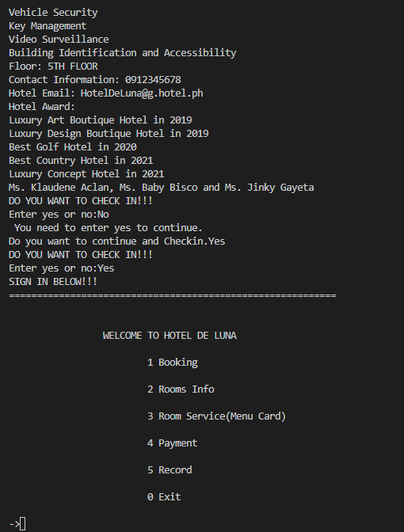
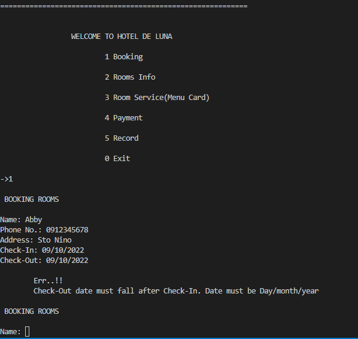
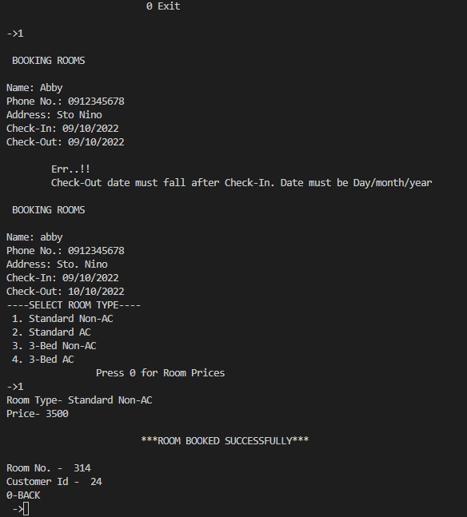
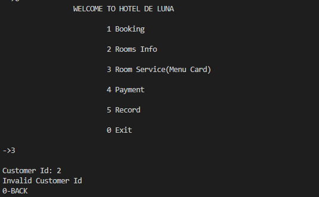
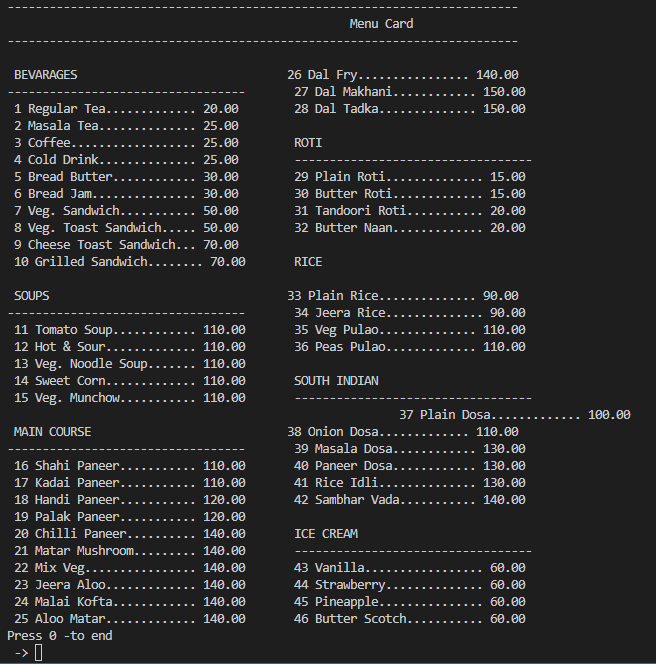
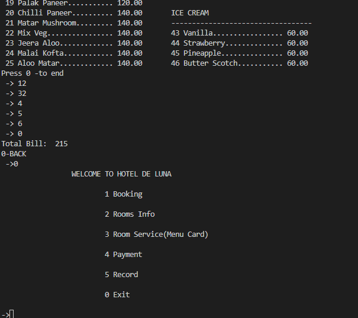
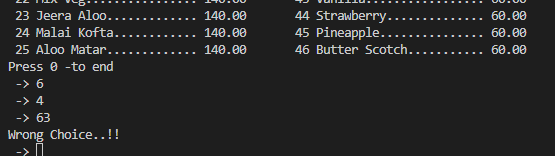
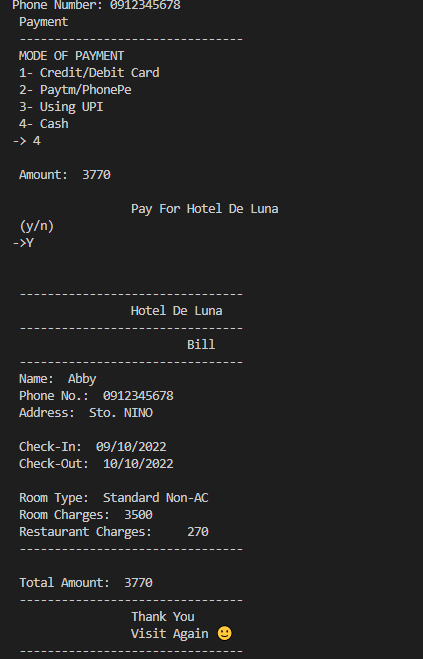

# HDLmanagementSystem

This Project on Hotel Management is a general software developed (using Python) to simplify hotel operations by automating them.
- By getting Information of custumer
- Booking a room
- To get the status of room
- To check the amenities available in the room
- Random CustId
- To find the payment information by providing the payment id
- To find the recent records od customer
- For easiy Paying Bill 

## Appendix

- We use encapsulation for the first function
- We use different Function
- Home()
- Date(str)
- Booking()
- Room_Info()
- Restaurant() 
- Payment()
- Record()

## Authors
- [@BayBisco19](https://github.com/BabyBisco19/HDLmanagementSystem.git)
- [@Klaudeneaclan](https://github.com/Klaudeneaclan/HDLmanagementSystem.git)
- [@Gayetajinky](https://github.com/Gayetajinky/HDLmanagementSystem.git)
## 🚀 About Me
 Im new about python...
## 🛠 Skills
Javascript, HTML....

## Self Asessment
- Code Reusability - 2/4
- Maintainability - 3/4
- Scalability - 3/4
- Execution - 2/4
- Originality - 2/4
- Overall Impression - 3/4
- Total = 15/24

## Demo
https://youtu.be/2dexo0pRRyo

## Screenshots

- 
- 
- 
- 
- 
- 
- 
- 
- 
- 
- 
- 

